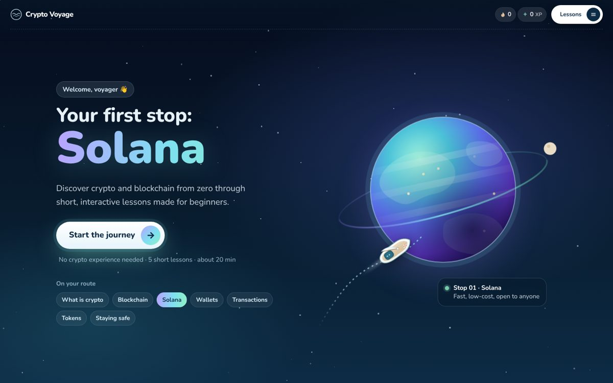
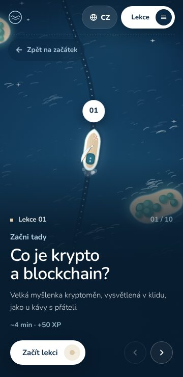
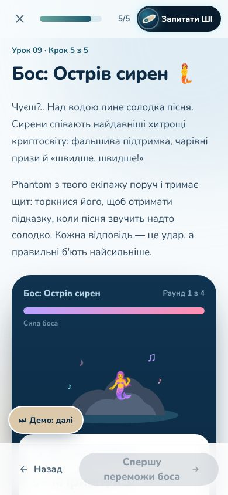
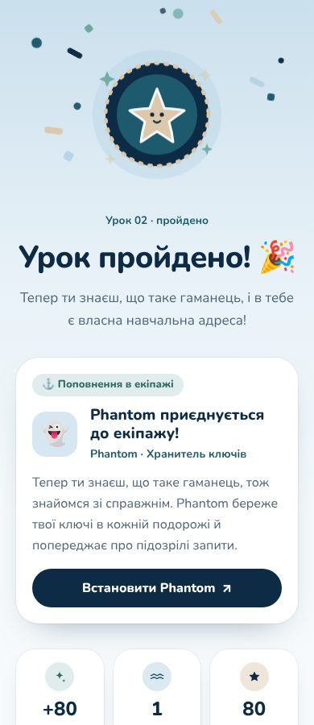
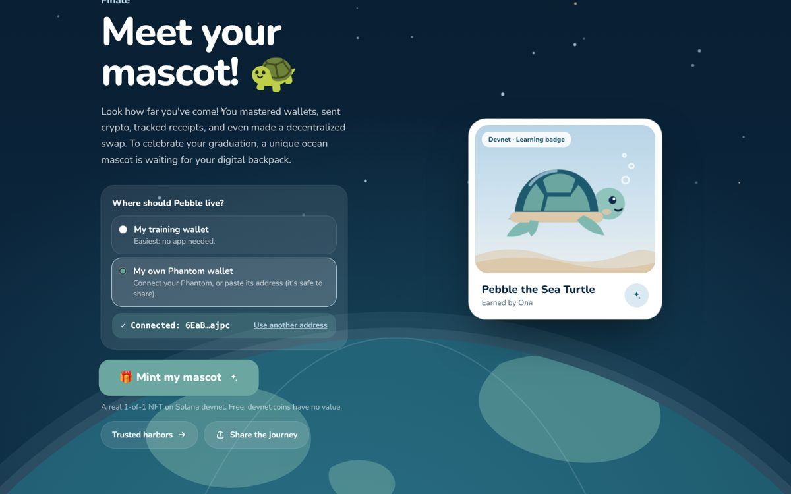
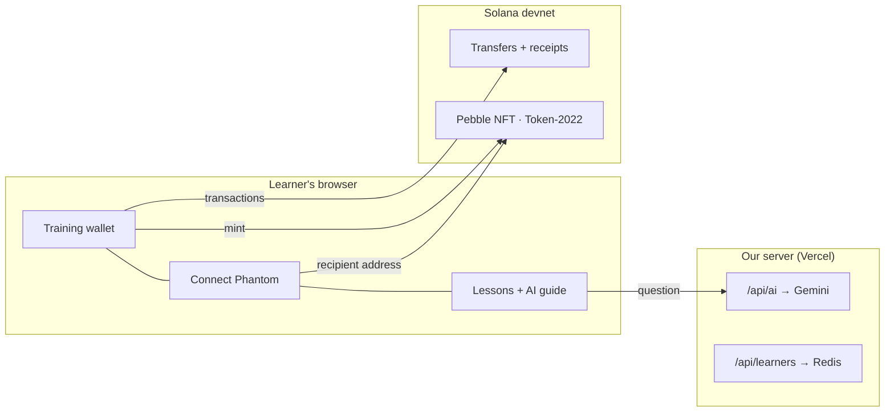

# Crypto Voyage

**Learn crypto from zero, like Duolingo — and end every lesson with a real, safe action on Solana.**

Crypto Voyage is a playful learning voyage for complete beginners. A little boat sails a route of 10 short lessons. Learners make a real Solana wallet, send real (test) SOL, check the receipt on Solana Explorer, beat scam "bosses", and finish with their own NFT in Phantom. Everything runs on **Solana devnet**: free, no real money, no seed phrases.

Built for the **SolanaCZE Build Station** (Prague, Oct 2026) and the **Colosseum** hackathon.

> **Live demo:** https://crypto-learning-platform-lyart.vercel.app/

<p>
  
</p>
<p>
  
  
  
</p>
<p>
  
</p>

## Why

Crypto apps are made for people who already know crypto. Beginners meet jargon, fear of clicking the wrong thing, and scams. Most articles explain; few let you *do* it safely. Crypto Voyage teaches by doing, in plain words, in the learner's own language.

## What's inside

| | |
| --- | --- |
| **10 lessons** | What is crypto · Your first wallet · Sending SOL · Block explorer · Your first swap · Staking · NFTs · Memecoins · Spot the scam · A vault for your treasure (hot vs cold wallet). Short steps, real-life examples, quizzes (single, multiple, true/false, fill-in, matching). Wrong answer → the right one + why, right away. No hearts, no leaderboard: streak + XP. |
| **Real Solana practice** | A training wallet on devnet: faucet, send 0.1 SOL, verify the receipt on Solana Explorer. Swap and liquid staking (mSOL) are clearly labelled simulations. |
| **Your first NFT** | At the finale the learner mints **Pebble the Sea Turtle**, a 1-of-1 Token-2022 NFT with on-chain metadata, into the training wallet or straight into **Phantom** ("Connect Phantom" shares only the public address). |
| **Bosses** | The Whirlpool of Hype (memecoins) and the Island of Sirens (scams): quick rounds, every answer lands a hit, no lives. Phantom's shield gives hints. |
| **The crew** | Partners join the voyage in learning order, never before their topic: Phantom after the wallet lesson, Bybit EU after the swap, Marinade after staking, Trezor after the vault lesson, Superteam at the finale. |
| **AI guide** | "Ask AI" in every lesson, powered by Gemini. It hints instead of giving quiz answers, explains mistakes, never gives financial advice, and replies in the learner's language. Works offline with hints from the lesson notes. |
| **5 languages** | English, German, Czech, Russian, Ukrainian — interface and all lessons. |
| **Light sign-up + demo mode** | Learners only give a name. `/admin` (password) shows who joined and adds a "⏭ Demo: next" button for live demos. |

## How Solana is used

All on **devnet**, with [Solana Kit](https://github.com/anza-xyz/kit):

- **Training wallet** — a devnet keypair created in the browser; faucet airdrop, `SystemProgram` transfers, and receipts read back from the chain (`src/lib/solana/devnet.ts`, `src/lib/training-wallet.ts`).
- **Pebble NFT** — Token-2022 mint with the MetadataPointer + TokenMetadata extensions, supply 1, decimals 0, mint authority removed after minting (`src/lib/solana/mascot.ts`, metadata at `/mascot/pebble.json`).
- **Phantom** — "Connect Phantom" reads the public address only (no signing); on phones it reopens the page in the Phantom app.
- **Explorer links** for every transaction and the NFT.



## Safety by design

- Devnet only. No real money, ever.
- We never ask for private keys or recovery phrases; lessons teach people never to share them.
- API secrets (`GEMINI_API_KEY`, `ADMIN_PASSWORD`) live only on the server. The admin session is a signed httpOnly cookie.
- The AI never sees the correct quiz answer before the learner has answered.

## Run it locally

```bash
npm install
cp .env.example .env.local   # all variables are optional for local dev
npm run dev                  # http://localhost:3000
```

| Variable | Needed for | Notes |
| --- | --- | --- |
| `NEXT_PUBLIC_SOLANA_RPC` | Wallet, NFT | Defaults to public devnet. A free Helius/QuickNode devnet URL is more reliable. |
| `GEMINI_API_KEY` | AI guide | Server only. Without it the guide uses lesson-note hints. |
| `GEMINI_MODEL` | AI guide | Optional, default `gemini-3.5-flash-lite`. |
| `ADMIN_PASSWORD` | `/admin` | Server only. |
| `KV_REST_API_URL`, `KV_REST_API_TOKEN` | Learner list | Upstash Redis (Vercel Marketplace adds them). |

**Visit statistics:** turn on Web Analytics in the Vercel project (Analytics tab). No cookies; see `/privacy`.

**Without devnet access** run a local validator: `solana-test-validator`, then build with `NEXT_PUBLIC_SOLANA_RPC=http://127.0.0.1:8899`. Smoke tests: `npx tsx scripts/devnet-smoke.mts`, `npx tsx scripts/mascot-smoke.mts`.

**Translations:** `npx tsx scripts/i18n-ui.mts` and `npx tsx scripts/i18n-lessons.mts` check that every language is complete.

**Quizzes:** `npm run check:quizzes` checks all 30 quizzes and 9 boss rounds in 5 languages: the correct answer exists and is accepted, a wrong answer is possible, every question has a real explanation, "select all that apply" has 2+ right and 1+ wrong options, no duplicate options, no text left in English.

**Whole learner journey:** `npm run build && npm start`, then `npm run test:e2e` (Playwright; first time: `npx playwright install chromium`). A robot learner goes landing → name → route → all 10 lessons (reading, quizzes with some wrong answers on purpose, boss battles, practice wallet) → NFT finale → progress, in 5 languages on a phone and a laptop. On every screen it checks for crashes, horizontal overflow and leftover English, that a wrong answer shows the correct one with its explanation at once, that multiple-choice uses square checkboxes, and that the XP adds up. Options: `--locales=uk --sizes=phone,small,laptop --base=https://… --headed`.

## Tech stack

Next.js 16 (App Router) · React 19 · TypeScript · Tailwind CSS v4 · Solana Kit · Token-2022 · Phantom · Google Gemini · Upstash Redis · Vercel.

## Project map

```
src/app/              pages + API routes (/api/ai, /api/learners, /api/admin/*)
src/content/lessons/  the 10 lessons (English source, structure + answers)
src/content/i18n/     lesson translations (uk, cs, ru)
src/content/voyage.ts the crew (partners) and bosses
src/i18n/             interface dictionaries, language switcher
src/lib/solana/       devnet helpers, NFT mint
src/components/       landing, boat route, lesson player, quizzes, boss battle, finale
```

More detail: [SPEC.md](SPEC.md) · [NFT guide](docs/nft-guide.md) · [design references](docs/design/).

## What's next

- A bridge to mainnet together with partners, when a learner is ready.
- A badge NFT for every finished lesson (compressed NFTs).
- Lessons on DeFi and Solana apps; more languages.

## Team

Olga Chernova — student at 42 Prague. _(Add teammates here if any.)_
