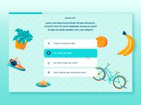
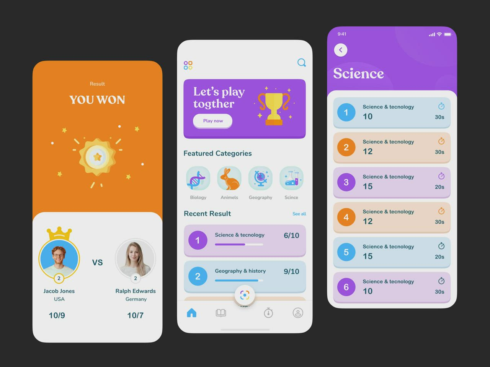

# Crypto Learning Platform — Web MVP Spec

A web platform that teaches crypto from zero for regular people who want to invest, in the style of Duolingo and SoloLearn, with gamification. The user goes through lessons, creates their first wallet, and earns an NFT mascot animal into it. Everything runs on Solana devnet. Interface and lessons in English for the first version.

Hackathon: SolanaCZE Build Station (Prague, 3–7 Oct 2026) / Colosseum Crypto World's Fair.

## Users

Complete crypto beginners — regular people, not developers. They have never used a wallet or made a transaction. They want to understand crypto for themselves and start investing. No programming is taught: only practical knowledge about crypto, wallets, transactions, and safety.

## Main action and why Solana

**Main action (Demo Day):** a beginner goes through a lesson, automatically gets a wallet, and sees their first NFT animal land in it.

**Why Solana:**

- Very cheap transactions, so we can reward every task without breaking the economy
- NFT as proof of learning — visual and onchain
- The lesson itself becomes an onchain action: the user's first crypto experience

## Lesson structure and quizzes

Each lesson is split into short paragraph-steps (SoloLearn style). After each paragraph there is a small quiz to reinforce. The learner moves in small steps and does not get overwhelmed.

**Quiz formats (mixed for variety):**

- Single correct answer (radio buttons)
- Multiple correct answers — the UI must clearly show that more than one is correct (square checkboxes, not round radio buttons, plus a "select all that apply" label)
- Fill in a word / short text answer
- True / False quick checks
- Match pairs (term to definition)

**Wrong answer:** immediately show the correct answer with an explanation of why it is correct. Keep quizzes simple and encouraging for beginners.

## MVP lessons

1. **Lesson 0 — What is crypto and blockchain.** Pure theory, no actions. How it works in general, so the person doesn't get lost later.
2. **Lesson 1 — Wallets.** What a wallet is, and creating your first Phantom wallet. MetaMask is only mentioned here as an example that different wallets exist for different networks (Phantom = Solana, MetaMask = Ethereum). Focus stays on Phantom.
3. **Lesson 2 — Send and receive crypto.** On devnet (test coins, nothing costs real money). The first transaction with no risk.
4. **Lesson 3 — Block explorer and reward.** The learner opens Solana Explorer and sees their own transaction onchain.

**Final step:** after all four lessons, a button "I finished all lessons" appears, and the user receives their NFT animal into their wallet.

**Mini-lesson — view your NFT animal:** step by step, where in Phantom to find the collectibles / NFT tab and see the mascot they just received. Closes the loop.

## Gamification

- Streak — days in a row of learning (Duolingo style)
- XP — experience points for completed lessons and quizzes
- No hearts/lives and no leaderboard for now (may add later)
- Animal mascots + NFT achievement (NFTs, not real tokens — cheap, no legal issues)

## Tech stack (Web2 developer path)

- **Frontend:** Next.js
- **Solana:** Solana Kit
- **Wallet:** embedded wallet, created automatically (e.g. via email) so the beginner never sees a seed phrase; later, connect Phantom
- **Network:** devnet
- **NFT:** Metaplex (compressed NFTs via Bubblegum v2 — see [docs/nft-guide.md](docs/nft-guide.md))
- **Explorer for the lesson:** Solana Explorer / Solscan / SolanaFM

## Safety rules (from the hackathon)

- Devnet only in the MVP
- Never ask for private keys
- Write tests, review signer checks

## Design and tone

The primary audience is women aged 25–45+ (not stated anywhere in the product — it just shapes the design).

**Visual style:**

- Rounded shapes — soft corners on cards, buttons, inputs
- Gentle, soft interface: soft ocean palette (below), lots of white space, light and airy
- Friendly typeface without sharp serifs

**Color palette (ocean):** ([image](docs/design/palette-ocean.png))

| Name | Hex |
| --- | --- |
| Deep ocean | #0D2B45 |
| Ocean teal | #1E5A6E |
| Seafoam | #6BA7A0 |
| Sandy beige | #DCC8AA |
| Light sky | #B7D4E6 |

**Design references:**

What we take from them (colors stay ours, the ocean palette):

- Quiz screen: the question at the top, answers as big rounded rows with a letter badge (A, B, C), the chosen answer highlighted
- Friendly flat illustrations around the content, light patterned background
- Lessons list as colored rounded cards: a number in a circle, the title, and a small progress bar
- Home page: a big welcome banner with one button, then a "continue learning" list
- Bottom navigation bar on mobile (home, lessons, progress, profile)
- Celebration screen after finishing (badge with sparkles) — fits the moment the learner gets the NFT animal
- Not taken: the "VS" duel screen with opponents, since we have no leaderboard

**Quiz template: [OceanX 2025 in Review](https://2025.oceanx.org/)** — the main style reference for lessons and quizzes (take the feel and structure, not their content, branding or photos):

- A lesson reads like an explorer's logbook: each step is its own full-screen "chapter", one after another, with lots of calm space between
- Big, bold display headline for each step and each quiz question; short, readable body text under it
- Soft ocean imagery behind or above the content, so the visuals carry the mood and the UI stays minimal
- A gentle "Keep exploring" button moves to the next step, like turning to the next chapter
- Progress shown as a journey (a timeline or route), not a score

**Tone of voice:**

- Warm and friendly, like explaining to a friend — not like a course or a lecture
- Very easy explanations, always with real-life examples instead of jargon
- Quizzes feel like a friendly check-in to reinforce, not a test

## Features for the first build

- **Mobile-adapted (responsive).** The web page must work well on a phone, not only on desktop.
- **"Ask AI" button in quizzes.** During a quiz, a button lets the learner ask an AI for help or an explanation.

## Pages (screen map)

1. **Home page** — entry point, short welcome, button to start learning.
2. **Lessons list** — opened from the home page; shows all lessons and progress.
3. **Lesson page** — paragraph-steps with quizzes and the "Ask AI" button.
4. **Partners page ("We recommend")** — opened by its own button; see below.

## Partners page

A "We recommend" page with hackathon partners: logo, a short beginner-friendly description, and a bonus if they offer one.

Partners give no bonuses for our product — we design our own in-app rewards for following a recommendation (e.g. extra XP or a special NFT). The only known partner bonus is Marinade's own $10 for signing up.

- **Marinade** — Solana staking. Announced at the event: a $10 bonus for signing up (confirm exact terms).
- **Trezor** — hardware wallet; fits a safety lesson for beginners (candidate).
- Not a fit: Accretion is a security-audit firm for developer teams, with no consumer product. Other event supporters to review later: Superteam, Bybit EU, RockawayX, mitonC, nodeMonster.

## Open questions

- [ ] Animal mascots: one growing companion vs a collection vs a hybrid (one companion + NFT reward at milestones)
- [ ] Which embedded-wallet provider to choose
- [ ] Whether 42 counts as University for the hackathon nomination (check Colosseum rules)
- [ ] Mascot design
- [ ] Pick the font
- [ ] Decide our own reward for the Partners page and which partners to list besides Marinade
